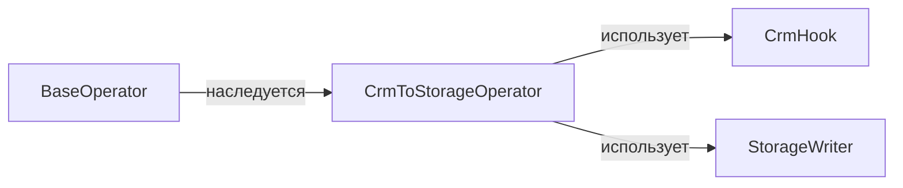

# ООП для Data Engineer: вопросы, ответы и примеры

Цель — объяснять устройство Python-кода на примерах загрузчиков, Airflow Hooks, правил качества и клиентов API. Для каждого вопроса сначала сформулируйте ответ вслух, затем разберите пример. Примеры стандартной библиотеки рассчитаны на Python 3.10+.

Практическая связь с Karpov DE: «Автоматизация ETL-процессов / Урок 5. Разработка своих плагинов», стр. 3, 7–8: наследование от `BaseOperator`/`HttpHook` и использование Hook внутри Operator. Вопросы ниже — самостоятельное учебное дополнение к этому кейсу.

## 1. Вопрос: чем класс отличается от объекта?

**Ответ:** класс задаёт тип, поведение и способ создания экземпляров; объект — конкретный экземпляр со своим состоянием. Два загрузчика одного типа могут читать разные источники.

```python
class Extractor:
    def __init__(self, source: str):
        self.source = source

crm = Extractor("crm")
billing = Extractor("billing")
print(type(crm) is type(billing), crm is billing)
# True False
```

**Наглядно:** `Extractor → crm(source="crm")` и `Extractor → billing(source="billing")`. Общий класс не означает общее состояние экземпляров.

## 2. Вопрос: как объяснить четыре принципа ООП через ETL?

| Принцип | Пример в Data Engineering | Что позволяет менять |
|---|---|---|
| Инкапсуляция | Клиент скрывает управление соединением за `read()` | Способ подключения |
| Абстракция | Загрузчик принимает источник с операцией `read()` | Конкретную систему-источник |
| Наследование | Кастомный оператор расширяет `BaseOperator` | Поведение шага Airflow |
| Полиморфизм | Один код вызывает `read()` у CSV- и API-источника | Реализацию без ветвления по типу |

**Наглядно:** `пайплайн → read() → CSV / API / PostgreSQL`. Вызывающий код знает договор операции, а детали остаются у адаптеров. Абстракция выделяет нужные возможности, инкапсуляция управляет доступом к внутренним деталям.

## 3. Вопрос: являются ли `_field` и `__field` приватными?

**Ответ:** `_field` — соглашение о внутреннем атрибуте. `__field` включает name mangling: имя преобразуется примерно в `_ClassName__field`. Это защита от случайного конфликта имён в наследниках, а не механизм безопасности. Секреты хранят в менеджере секретов, а не в «приватном» поле класса.

```python
class ApiClient:
    def __init__(self):
        self.__attempts = 0

client = ApiClient()
print(client._ApiClient__attempts)  # 0: доступ технически возможен
```

## 4. Вопрос: чем атрибут класса отличается от атрибута экземпляра?

**Ответ:** атрибут класса общий для экземпляров, пока экземпляр не затенил его своим атрибутом. Изменяемый список на уровне класса особенно опасен для загрузчиков.

```python
class BadBatch:
    rows = []

a, b = BadBatch(), BadBatch()
a.rows.append("order-1")
print(b.rows)  # ['order-1']

class Batch:
    def __init__(self):
        self.rows = []

x, y = Batch(), Batch()
x.rows.append("order-1")
print(y.rows)  # []
```

**Наглядно:** в первом случае `a → общий список ← b`; во втором `x → список X`, `y → список Y`.

## 5. Вопрос: что делают `self`, `__new__` и `__init__`?

**Ответ:** `self` — обычное имя параметра, которому при вызове метода передаётся экземпляр. `__new__` создаёт и возвращает объект; `__init__` настраивает уже созданный объект и должен вернуть `None`. Переопределять `__new__` в обычном ETL-клиенте обычно не требуется.

```text
Client(config) → __new__: создать объект → __init__: записать config → готовый Client
client.read()  → Client.read(client): экземпляр передан как self
```

**Ловушка:** открыть сеть в конструкторе Airflow Operator — значит делать I/O при построении DAG. Создание соединения откладывают до выполнения задачи.

## 6. Вопрос: когда нужен обычный метод, `classmethod` или `staticmethod`?

| Вид метода | Получает автоматически | Пример |
|---|---|---|
| Обычный | `self` | `client.read_page()` использует состояние клиента |
| `classmethod` | `cls` | `Client.from_config(config)` создаёт экземпляр нужного класса |
| `staticmethod` | Ничего | Вспомогательная проверка, связанная с классом по смыслу |

```python
class Source:
    def __init__(self, name: str):
        self.name = name

    @classmethod
    def from_config(cls, config: dict):
        return cls(config["name"])

    @staticmethod
    def is_valid_name(name: str) -> bool:
        return bool(name.strip())

print(Source.from_config({"name": "crm"}).name)  # crm
print(Source.is_valid_name(""))  # False
```

**Наглядно:** фабрика через `cls(...)` сохранит тип наследника при наследовании `from_config`. Если функция не связана с классом, отдельная функция модуля часто проще `staticmethod`.

## 7. Вопрос: когда предпочесть композицию наследованию?

**Ответ:** наследование выражает «является разновидностью» и требует взаимозаменяемости. Композиция выражает «использует» и позволяет менять независимые компоненты. Operator является `BaseOperator`, но использует Hook; он не должен наследоваться одновременно от HTTP-клиента и S3-клиента ради доступа к их методам.



**Пример:** S3Writer можно заменить LocalWriter для локальной проверки, не меняя класс оператора. Для небольшой чистой трансформации достаточно функции; создавать класс для каждого SQL-запроса не обязательно.

## 8. Вопрос: что такое duck typing, `Protocol` и абстрактный класс?

**Ответ:** duck typing использует доступное поведение без проверки номинального типа. `Protocol` описывает структурный интерфейс для проверки типов. ABC с `@abstractmethod` запрещает создание экземпляра, пока абстрактные методы не реализованы. Аннотация `Protocol` сама по себе не проверяет данные во время выполнения.

```python
from typing import Protocol

class Source(Protocol):
    def read(self) -> list[int]: ...

class FakeSource:
    def read(self) -> list[int]:
        return [10, 20]

def total(source: Source) -> int:
    return sum(source.read())

print(total(FakeSource()))  # 30; FakeSource не наследуется от Source
```

**Наглядно:** `total → контракт read() ← FakeSource / ApiSource`. Даже `@runtime_checkable` проверяет наличие членов, а не полную совместимость сигнатур и бизнес-семантику.

## 9. Вопрос: что такое SOLID и как применить его без лишних классов?

| Принцип | Практическое решение для DE | Наглядный антипример |
|---|---|---|
| SRP: одна причина изменения | Чтение API, расчёт скидки и запись разделены | Изменение URL ломает расчёт выручки |
| OCP: расширение через контракт | Новый источник реализует `read()` | Для каждого источника растёт `if type == ...` |
| LSP: подстановка сохраняет договор | Любой Writer сохраняет данные или сообщает об ошибке | Наследник Writer молча выбрасывает строки |
| ISP: небольшие интерфейсы | Отдельные Reader и Writer | CSV Reader обязан реализовать бесполезный `delete()` |
| DIP: зависимость от абстракции | Pipeline принимает Writer извне | Pipeline сам создаёт конкретный сетевой клиент |

**Наглядно:** `Pipeline → Reader / Transform / Writer`, а реализации подставляются на границе приложения. SOLID помогает управлять изменениями; количество классов не является показателем качества.

## 10. Вопрос: что такое dependency injection?

**Ответ:** передача зависимости извне вместо её скрытого создания внутри функции или класса. Можно передать объект, функцию или фабрику; отдельный DI-фреймворк не обязателен.

```python
from collections.abc import Callable

def pipeline(read: Callable[[], list[int]], write: Callable[[list[int]], None]):
    write([value * 2 for value in read()])

saved = []
pipeline(lambda: [2, 3], saved.extend)
print(saved)  # [4, 6]
```

**Наглядно:** `production: read API → pipeline → write DB`; `test: фиксированные строки → тот же pipeline → список`. Так тест не зависит от сети.

## 11. Вопрос: как связаны `__eq__`, `__hash__` и неизменяемость?

**Ответ:** если `a == b`, обязательно `hash(a) == hash(b)`; обратное неверно. Хеш ключа не должен меняться, пока объект находится в `dict` или `set`. Если определить `__eq__` без подходящего `__hash__`, Python обычно сделает экземпляры нехешируемыми.

```python
from dataclasses import dataclass

@dataclass(frozen=True)
class EventKey:
    source: str
    event_id: str

a = EventKey("crm", "42")
b = EventKey("crm", "42")
print(a == b, hash(a) == hash(b), len({a, b}))  # True True 1
```

**Наглядно:** `равны → одинаковые хеши`; `одинаковые хеши ↛ равны`. `frozen=True` запрещает присваивание полей, но не делает вложенный список неизменяемым. Поля ключа должны сами поддерживать стабильное хеширование. Подробности: [коллизии и дедупликация](../02-middle/14-hashing-and-deduplication.md).

## 12. Вопрос: где уместен `dataclass`, а где нужна валидация?

**Ответ:** `dataclass` сокращает код объектов данных: генерирует `__init__`, `__repr__`, сравнение. Аннотации типов не валидируют входной JSON. Ограничения проверяют явно или библиотекой валидации на входе.

```python
from dataclasses import dataclass

@dataclass(frozen=True)
class BatchConfig:
    size: int

    def __post_init__(self):
        if self.size <= 0:
            raise ValueError("size must be positive")

print(BatchConfig(100))  # BatchConfig(size=100)
```

**Наглядно:** `JSON → проверка формы и типов → проверка бизнес-условий → объект → обработка`. Этот пример проверяет положительность уже типизированного размера; для внешнего JSON дополнительно проверяют тип.

## 13. Вопрос: что такое MRO и зачем `super()`?

**Ответ:** MRO задаёт порядок поиска методов при наследовании. `super()` вызывает следующую реализацию согласно MRO, а не всегда непосредственного родителя. При множественном наследовании кооперативные методы должны согласовать сигнатуры и последовательно вызывать `super()`.

```python
class Base:
    def run(self):
        return ["base"]

class Logging(Base):
    def run(self):
        return ["log"] + super().run()

class Retry(Base):
    def run(self):
        return ["retry"] + super().run()

class Job(Logging, Retry):
    pass

print(Job().run())  # ['log', 'retry', 'base']
print([cls.__name__ for cls in Job.__mro__])
# ['Job', 'Logging', 'Retry', 'Base', 'object']
```

**Наглядно:** `Job → Logging → Retry → Base`. Для независимых retry и logging часто легче читать композицию или декораторы.

## 14. Вопрос: зачем контекстный менеджер и почему недостаточно `__del__`?

**Ответ:** `with` обеспечивает вызов `__exit__` при нормальном выходе и исключении после успешного `__enter__`. Время финализации объекта не гарантировано; освобождение файла или соединения нельзя строить только на `__del__`.

```text
with resource:
    __enter__ → обработка → успех или исключение → __exit__ → освобождение ресурса
```

**Ловушка для DE:** освобождение соединения и завершение транзакции — разные операции. У `psycopg2` контекст соединения управляет commit/rollback, но сам не закрывает соединение. Следуйте договору конкретного драйвера. Возврат truthy из `__exit__` подавляет исключение, поэтому делать так без причины опасно.

## 15. Вопрос: зачем `property` и что такое дескриптор?

**Ответ:** `property` позволяет сохранить синтаксис чтения атрибута, добавив вычисление или проверку при записи. Это пример дескриптора — объекта, управляющего доступом через `__get__`, `__set__` или `__delete__`.

```text
config.batch_size = 0 → setter → проверка → ValueError
config.batch_size = 1000 → setter → запись внутреннего значения
```

**Пример:** защита положительного размера батча. Скрывать медленный HTTP-запрос в `client.rows` неудобно: отдельный `fetch_rows()` явно показывает затратную операцию.

## 16. Вопрос: зачем `__slots__` и заменяет ли он колоночную обработку?

**Ответ:** `__slots__` задаёт доступные атрибуты и в подходящей иерархии убирает отдельный `__dict__` экземпляра. Это может снизить расход памяти миллионов небольших объектов; величину экономии измеряют. Наследник без `__slots__` может снова получить `__dict__`.

```text
Миллион Python-объектов: заголовок объекта + ссылки + возможный __dict__
Колоночный Arrow-массив: буферы значений + маска NULL + метаданные
```

**Ловушка:** `__slots__` не устраняет стоимость миллиона Python-объектов. Для массовых преобразований рассмотрите SQL, Arrow, Polars или Spark и измерьте результат.

## 17. Вопрос: какие паттерны проектирования полезны для DE?

| Паттерн | Кейс | Наглядная связь |
|---|---|---|
| Strategy | Разные правила очистки или дедупликации | `Pipeline → выбранная стратегия` |
| Adapter | API и CSV приводятся к единому договору чтения | `API → Adapter → Reader` |
| Factory | Выбор адаптера по конфигурации | `config → Factory → Reader` |
| Decorator | Метрики и контролируемые retries вокруг вызова | `metrics(retry(read))` |
| Template Method | Фреймворк задаёт цикл, пользователь реализует шаг | `Airflow lifecycle → execute()` |

**Ответ:** выбирайте паттерн под реальную точку изменения. Retry должен учитывать идемпотентность, а глобальный Singleton-сетевой клиент может создавать проблемы после `fork`, при конкуренции и в тестах. Фабрика без общего изменяемого состояния часто проще.

## Практика для устного и coding-интервью

1. Спроектируйте Reader и Writer для API → хранилище; замените их тестовыми реализациями.
2. Найдите общий изменяемый список в классе загрузчика и объясните результат двух запусков.
3. Покажите нарушение LSP: Writer сообщает об успехе, сохранив только половину строк.
4. Напишите неизменяемый ключ `(source, event_id)` и объясните, почему одного `event_id` может быть недостаточно.

Продолжение: [разработка надёжных пайплайнов](../02-middle/13-software-engineering-for-data-engineers.md), [блиц-вопросы](../04-interview-cheatsheets/software-engineering-speedrun-qa.md).

## Источники для проверки деталей

- [Python: модель объектов, хеширование и специальные методы](https://docs.python.org/3/reference/datamodel.html).
- [Python: Protocol](https://docs.python.org/3/library/typing.html#typing.Protocol), [dataclasses](https://docs.python.org/3/library/dataclasses.html).
- [Airflow: разработка кастомного оператора](https://airflow.apache.org/docs/apache-airflow/stable/howto/custom-operator.html).
- [psycopg2: соединение как контекстный менеджер](https://www.psycopg.org/docs/connection.html).
