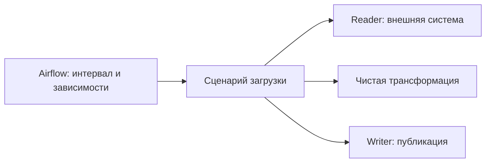
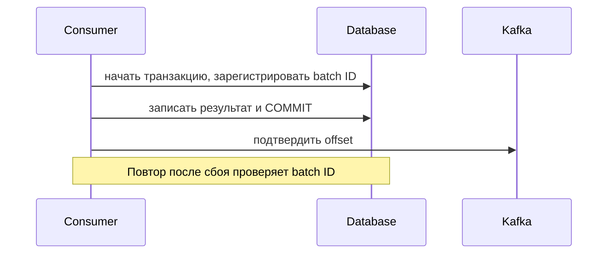
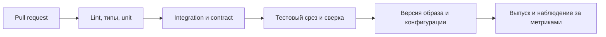

# Разработка ПО для Data Engineer: от функции к надёжному пайплайну

Предварительные темы: [Python](../01-junior/04-python-for-data-engineers.md) и [ООП](../01-junior/06-oop-for-data-engineers.md). Здесь собраны вопросы на стыке разработки ПО и инженерии данных. Для Middle важно показать рабочий механизм и сценарий сбоя; для Senior — его границы и стоимость эксплуатации.

Кейсы опираются на темы Karpov DE: разработка Airflow-плагинов, сложные ETL-пайплайны, Data Quality, версионирование данных и запуск вычислений в Kubernetes. Архитектурные решения и вопросы — самостоятельное дополнение, а не дословное изложение курса.

## 1. Вопрос: как разделить код пайплайна на модули?

**Ответ:** вынести чистые преобразования из кода оркестрации и I/O. Адаптеры знают API и драйверы, бизнес-функции — смысл данных, оркестратор — последовательность шагов и интервалы запуска. Не дробить каждую строку на отдельный класс.



**Наглядный кейс:** сменился API CRM → меняется Reader; сменилось правило расчёта выручки → меняется Transform. Тот же Transform работает при ежедневной загрузке и backfill.

## 2. Вопрос: что такое чистая функция и детерминированный расчёт?

**Ответ:** чистая функция зависит только от аргументов и не меняет внешнее состояние. Детерминированность означает одинаковый результат при одинаковых входах. Запрос к изменяющейся БД может быть без записи, но всё равно не быть чистым.

```python
from decimal import Decimal

def net_amount(gross: Decimal, discount: Decimal) -> Decimal:
    if not Decimal("0") <= discount <= Decimal("1"):
        raise ValueError("discount must be between 0 and 1")
    return gross * (Decimal("1") - discount)

print(net_amount(Decimal("100"), Decimal("0.10")))  # 90.00
```

**Наглядно:** `вход + версия правил → результат`. Если функция использует текущую дату, случайность или текущий курс валют, передайте их аргументами и зафиксируйте для воспроизводимости. Для денег договоритесь также о валюте и округлении.

## 3. Вопрос: какие тесты нужны ETL и что проверять моками?

| Вид теста | Что проверяет | Пример сбоя |
|---|---|---|
| Unit | Правило на маленьком наборе | Неверная скидка, NULL, граница даты |
| Contract | Договор схемы и семантики | `amount` стал строкой или сменил валюту |
| Integration | Настоящий адаптер и хранилище | Неверный SQL, rollback, несовместимый драйвер |
| End-to-end | Путь от источника до опубликованной витрины | Загрузка успешна, витрина не обновилась |
| Data quality | Состояние конкретных данных | Дубли ключа, потеря строк, устаревший срез |

**Наглядно:** `100 unit → 10 integration → несколько E2E` — иллюстрация формы пирамиды, а не обязательное соотношение. Fake полезен для управляемого поведения; Mock — для проверки взаимодействий. Мок PostgreSQL не доказывает корректность транзакций PostgreSQL.

**Пример проверки:** `assert net_amount(Decimal("100"), Decimal("0.10")) == Decimal("90.00")`. Затем отдельно проверяют недопустимую скидку, округление по договору и повторный запуск загрузки.

## 4. Вопрос: в чём разница между ошибкой инфраструктуры и ошибкой данных?

**Ответ:** временная сетевая ошибка может исчезнуть после повтора. Некорректный формат, отсутствующее обязательное поле или несовместимый контракт требуют другого действия. `except Exception: pass` превращает потерю данных в ложный успех.

```text
HTTP timeout → ограниченный retry → успех / ошибка задачи
Неверный тип amount → quarantine с причиной → исправление / контролируемый replay
Неверная авторизация → остановка и сигнал → исправление конфигурации
```

**Уточнение:** правило «продолжать с хорошими строками» зависит от договора. Для финансового отчёта нарушение полноты может требовать блокировки всей публикации. Сохраняйте первопричину через `raise ... from ...`, а токены и PII исключайте из логов.

## 5. Вопрос: когда retry безопасен и зачем backoff с jitter?

**Ответ:** после timeout неизвестно, выполнила ли принимающая сторона операцию. Безопасность повтора обеспечивают идемпотентность, ключ операции или проверка её состояния. Backoff увеличивает задержку, jitter рассинхронизирует клиентов. Ограничьте число попыток и общий deadline, учитывайте `Retry-After`.

```text
Без jitter: 100 клиентов → повтор в 1 с → повтор в 2 с → новый пик нагрузки
С jitter:   клиенты распределяют повторы внутри интервалов ожидания
Два уровня по 3 попытки: внешний retry × внутренний retry = до 9 обращений
```

**Ловушка:** retries оркестратора и retries HTTP-клиента складываются в нагрузку. Укажите владельца политики повторов. Повторить GET обычно проще, чем повторить отправку платёжного POST без idempotency key.

## 6. Вопрос: что означает идемпотентность загрузки?

**Ответ:** повтор одной логической операции сохраняет тот же целевой результат: `F(F(state, batch), batch) = F(state, batch)`. Нужны стабильная идентичность операции, договор конфликта версий и атомарная запись. Один `MERGE` не решает дубли в источнике и гонки автоматически.

```text
batch-17: event-42, amount=100
APPEND дважды → две строки → выручка 200
UPSERT по (source, event_id) дважды → одна строка → выручка 100
```

**Follow-up:** `event_id=42, version=2` — новое состояние, а не транспортный дубль версии 1. Сначала выберите актуальную версию по source sequence, затем определите политику для событий с одинаковой версией и разным payload.

## 7. Вопрос: как согласовать запись результата и отметку прогресса?

**Ответ:** запись результата и запись обработанного batch ID в одной БД можно объединить в транзакцию. Нужны уникальность batch ID и правильная обработка конкуренции. Offset внешнего брокера не становится частью транзакции PostgreSQL автоматически.



| Момент сбоя | Что должно случиться при повторе |
|---|---|
| До DB commit | Транзакция откатывается; батч выполняется заново |
| После DB commit, до offset commit | Батч читается снова; реестр предотвращает повторный эффект |
| Два воркера получили один batch ID | Уникальное ограничение и транзакция допускают один эффект |

**Граница гарантии:** внешний email или HTTP-вызов не откатится вместе с этой БД. Нужен свой договор с внешней системой.

## 8. Вопрос: что решает transactional outbox?

**Ответ:** бизнес-изменение и сообщение outbox записывают в одной локальной транзакции. Отдельный relay публикует outbox через polling или CDC. Так не возникает окна «данные изменены, событие не записано». Relay всё ещё может отправить событие повторно, поэтому потребитель дедуплицирует по `event_id`.

```text
Транзакция: UPDATE order + INSERT outbox(event_id) → COMMIT
Relay: outbox → брокер → отметка отправки
Сбой после публикации до отметки → повтор того же event_id → dedup у потребителя
```

**Ловушка:** назвать outbox универсальным exactly-once. Он устраняет конкретную проблему dual write, но не все повторные эффекты системы.

## 9. Вопрос: как устроить безопасный backfill?

**Ответ:** задавать явные интервалы, зафиксировать версию кода и входов, ограничить параллелизм, писать в изолированную область, сверять данные и публиковать управляемо. Откат кода и откат данных — разные процедуры.

```text
Интервал [2026-09-01, 2026-09-02) → расчёт в staging v2 → сверка → публикация
Следующий [2026-09-02, 2026-09-03) → тот же алгоритм без двойного счёта границы
```

**Follow-up:** если live-загрузка меняет тот же период, используйте блокировку, версионирование или согласованную последовательность публикаций. Определите UTC/локальную зону и семантику переходов времени; прибавить 24 часа не всегда означает следующий календарный день.

## 10. Вопрос: как применять CI/CD к данным и коду?

**Ответ:** проверять код и договоры до выпуска; миграцию схемы, вычисление и публикацию рассматривать отдельно. Проверить импорт DAG полезно, но это не доказывает корректность данных.



**Кейс:** `schema v2 + code v2` проверили на изолированном срезе. Если после выпуска пропала полнота, остановите публикацию, сохраните входы и восстановите согласованный набор данных. Повторно запустить старый контейнер недостаточно для исправления уже испорченной витрины.

## 11. Вопрос: как провести совместимое изменение схемы?

**Ответ:** использовать expand → migrate → contract: добавить совместимое поле, научить потребителей понимать его, заполнить историю, проверить переход, затем удалить старое. Совместимость зависит от формата, направления чтения и конкретных потребителей.

```text
v1: amount
v2: amount + amount_minor_units (новое поле, допустимый default/NULL по договору)
Потребители переходят на новое поле → backfill проверен → v3 удаляет старое
```

**Ловушка:** добавление nullable-колонки может сломать `SELECT *`, позиционный CSV или строгую модель. Смена валюты при прежнем имени и типе — семантическая несовместимость, которую одна проверка схемы не обнаружит.

## 12. Вопрос: зачем типизация, если вход всё равно проверяют во время выполнения?

**Ответ:** статическая типизация помогает находить ошибки взаимодействия модулей до запуска. Runtime-валидация проверяет реальные данные на границе. Контракт добавляет смысл, владельца и требования к данным. Эти проверки дополняют друг друга.

```text
Внешний JSON → runtime-валидация → типизированная модель → бизнес-правила
Статическая проверка ────────────────────────────────↑ проверяет код
```

**Пример:** `amount: Decimal` в сигнатуре не запрещает вызывающему коду передать строку во время выполнения. Поле `currency="USD"` не гарантирует, что источник действительно прислал USD; это нужно проверять по договору.

## 13. Вопрос: как выбирать сериализацию и что отправлять воркерам?

**Ответ:** учитывать типы, размер, совместимость схем, безопасность и потребителей. JSON удобен для обмена, Avro/Protobuf — для явно заданных схем сообщений, Parquet — для аналитического хранения. Не отправлять открытое соединение как часть задания; передавайте конфигурацию и создавайте ресурс на воркере.

```text
Driver → {source_id, interval, config_version} → Worker → новое соединение → обработка
Driver → живой socket / lock / connection → сериализация может не сработать
```

**Ловушка:** десериализация `pickle` из недоверенного источника может выполнить код. Это не формат публичного контракта. Зафиксируйте представление decimal, timestamp, timezone и NULL: преобразование в JSON-строки без договора легко теряет смысл.

## 14. Вопрос: threads, processes или asyncio для выгрузки?

| Нагрузка | Кандидат | Что измерить |
|---|---|---|
| Многие сетевые ожидания | Threads или asyncio с неблокирующими клиентами | Rate limit, timeouts, пул соединений |
| CPU-bound Python-код | Processes либо нативная/распределённая обработка | Сериализация, IPC, память |
| Большие табличные расчёты | SQL, Polars, Spark | План, shuffle, объём и стоимость |

**Наглядно:** две загрузки по 1 с ожидания могут перекрываться; две секунды Python-вычислений не обязаны стать одной при запуске двух threads. В обычной сборке CPython с GIL Python-байткод исполняет один поток за раз; нативные библиотеки могут освобождать GIL. Существуют отдельные free-threaded-сборки; уточняйте среду.

## 15. Вопрос: почему GIL не устраняет race condition?

**Ответ:** логическая операция обычно состоит из нескольких шагов. Два исполнителя могут прочитать одно состояние и принять конфликтующие решения. Межпроцессные и распределённые гонки тем более не зависят от GIL.

```text
Worker A: проверил «batch не обработан» ─┐
Worker B: проверил «batch не обработан» ─┼→ оба пытаются записать результат
                                      └→ UNIQUE + транзакция ограничивают эффект
```

**Кейс:** lock в памяти защищает только область видимости этого lock, но не другой Airflow worker. Для гонки в БД используйте её ограничения и транзакции; для внешнего API — его механизм идемпотентности.

## 16. Вопрос: что такое backpressure и почему опасна безразмерная очередь?

**Ответ:** если источник быстрее потребителя, накапливается очередь или lag. Backpressure ограничивает приём и параллелизм, чтобы не исчерпать память и не перегрузить downstream. Буфер сглаживает краткие пики, но не исправляет постоянный дефицит мощности.

```text
Источник: 1000 строк/с → очередь → Writer: 600 строк/с
Без ограничения: +400 строк/с → +24 000 строк за минуту → рост RAM/lag
С ограничением: bounded queue → пауза чтения → контролируемая нагрузка
```

**Follow-up:** для Kafka чтение можно замедлить, но ограничено retention и SLO задержки. Масштабирование потребителей ограничено партициями и возможностями хранилища.

## 17. Вопрос: какие метрики и логи нужны пайплайну?

**Ответ:** наблюдайте не только за успешным процессом, но и за результатом для потребителя: freshness, полнотой, дублями, lag, rejected rows, временем публикации. Логи связывают через `run_id`, `batch_id`, источник и интервал; в метриках избегают высококардинальных event ID.

```text
Task success + 0 строк + freshness 8 часов при SLO 1 час → инцидент данных
Task success + 1 млн строк + reconciliation пройдена → подтверждённый результат
```

**Follow-up:** SLI — измеряемая характеристика; SLO — целевой уровень, например «99% публикаций доступны в течение часа после закрытия интервала». SLA — договор обязательств, который может включать последствия нарушения. Порог и действия назначает владелец продукта.

## 18. Вопрос: как организовать Git, review, зависимости и конфигурацию?

**Ответ:** небольшое изменение с объяснением поведения, тестами значимых случаев и планом восстановления проще проверить. Разрешайте конфликт, понимая обе версии правил, а затем проверьте результат на данных. Фиксируйте зависимости и версии образов; секреты отделяйте от кода и не записывайте в Git.

```text
code commit + dependency lock + image digest + config version + input snapshot
                                      ↓
                        воспроизводимый запуск и расследование
```

**Ловушка:** Git хранит версию кода, но не снимок живого API. Восстановление результата требует доступа к исходным данным и версиям внешних зависимостей. Не помещайте пароли в параметры, которые оркестратор показывает в UI.

## Практический кейс для собеседования

API → Airflow → хранилище заказов. API отдаёт страницы, иногда возвращает 429, а worker может упасть после записи результата.

Разберите последовательно: договор идентичности заказа → параметры интервала → пагинацию и сохранение прогресса → валидацию → политику retries → дедупликацию/версии → транзакцию → публикацию → метрики → unit/integration/failure-тесты. Затем объясните, что изменится при backfill и параллельном live-запуске.

Продолжение: [хеширование и дедупликация](14-hashing-and-deduplication.md), [блиц](../04-interview-cheatsheets/software-engineering-speedrun-qa.md), [дополнительные DE-вопросы](../04-interview-cheatsheets/common-de-interview-questions.md).

## Источники

- [Python: threads и GIL](https://docs.python.org/3/library/threading.html#gil-and-performance-considerations), [asyncio](https://docs.python.org/3/library/asyncio.html), [небезопасность недоверенного pickle](https://docs.python.org/3/library/pickle.html).
- [Kafka: гарантии доставки и границы exactly-once](https://kafka.apache.org/41/design/design/).
- [PostgreSQL: изоляция транзакций](https://www.postgresql.org/docs/current/transaction-iso.html).
- [Airflow: лучшие практики разработки DAG](https://airflow.apache.org/docs/apache-airflow/stable/best-practices.html).
- [Debezium: outbox event router](https://debezium.io/documentation/reference/stable/transformations/outbox-event-router.html).
