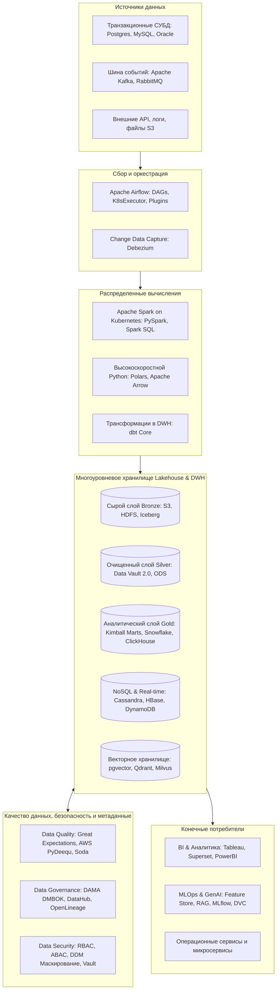

# Ultimate Data Engineering Interview Preparation

[](#)
[](#)
[](#)
[](#)
[](#)

Комплексная база знаний и практическое руководство для подготовки к техническим интервью на позиции **Junior**, **Middle** и **Senior Data Engineer**, а также **Database Developer / Архитектор баз данных**.

Все материалы систематизированы на русском языке и включают реальные кейсы высоконагруженных систем, распределенных кластеров Big Data, корпоративных хранилищ данных (DWH) и аналитических платформ.

**Начните с [короткой памятки перед интервью](04-interview-cheatsheets/interview-preparation-memo.md).** Для практики на стыке разработки ПО и данных: [ООП](01-junior/06-oop-for-data-engineers.md), [разработка надёжных пайплайнов](02-middle/13-software-engineering-for-data-engineers.md), [коллизии хешей и дедупликация](02-middle/14-hashing-and-deduplication.md). Сложные темы дополнены наглядными разборами: исходные данные → шаги механизма → результат и ограничения. Схемы Mermaid отображаются в GitHub; пошаговые текстовые схемы читаются в любом Markdown-редакторе.

База знаний объединяет материалы ведущих индустриальных источников:
- Оригинальный банк вопросов и сценариев технических собеседований Big Data.
- Программа и практические конспекты курса **Karpov Courses: Инженер данных** (Data Vault 2.0, Anchor Modeling, экосистема Hadoop/HBase, Kubernetes для DE, AWS Deequ, DVC и MLOps).
- Профессиональный стек из 108 специализированных навыков **Antigravity v17.5.0** (dbt, Snowflake, Polars, Great Expectations, Cassandra, DynamoDB, pgvector, HNSW, Spark Internals).

---

## Архитектура современной корпоративной платформы данных



---

## 1. Матрица компетенций Data Engineer по грейдам

| Направление | Junior Data Engineer | Middle Data Engineer | Senior / Lead Data Engineer |
| :--- | :--- | :--- | :--- |
| **SQL и Базы данных** | DDL/DML, типы JOIN, агрегации, логика NULL, индексы B-Tree, нормализация 1NF-3NF. | Оконные функции, Running Total, рекурсивные CTE, анализ `EXPLAIN`, транзакции ACID, пулеры соединений. | Внутреннее устройство СУБД, LSM-деревья, распределенные шарды, партиционирование, NoSQL (Cassandra, HBase, DynamoDB). |
| **ООП и разработка ПО** | Классы и объекты, композиция, полиморфизм, изменяемость, `__eq__`/`__hash__`, чистые функции. | SOLID, Protocol/ABC, dependency injection, unit/integration-тесты, retries, идемпотентность, CI/CD, schema evolution. | Границы транзакций и exactly-once, outbox, конкурентные записи, безопасный backfill, SLO, воспроизводимость и выпуск данных. |
| **Моделирование DWH** | Понимание таблиц фактов и измерений, схема «Звезда». | Размерное моделирование Кимбалла, «Снежинка», SCD 1–6, dbt-модели (staging/intermediate/marts). | Data Vault 2.0 (Hub, Link, Sat, PIT, Bridge), Anchor Modeling (6NF), Inmon CIF, Lakehouse Medallion. |
| **Распределенная обработка** | Основы Spark (RDD vs DataFrame), запуск базовых трансформаций. | Тюнинг Catalyst Optimizer, `repartition` vs `coalesce`, кэширование, устранение OOM, Polars vs Pandas. | Spark Internals: Shuffle write/read, Data Skew, Salting, Adaptive Query Execution (AQE), 4-уровневое профилирование. |
| **Экосистема Hadoop** | Назначение HDFS и MapReduce на базовом уровне. | Архитектура HDFS (NameNode/DataNode, репликация), YARN (Schedulers), Hive (Managed/External, ORC). | HDFS High Availability (QJM/ZKFC), HBase (RegionServer, MemStore, HFile, Splits, Compactions, RowKey design). |
| **Оркестрация и качество** | Написание простых Airflow DAG, операторы. | Сенсоры (`reschedule`), XCom, кастомные плагины (Hooks/Operators), dbt tests, Great Expectations, Soda Core. | Кластер Airflow (Celery/K8s), Data Contracts (Shift-Left), распределенный аудит PyDeequ на Spark, SLA конвейеров. |
| **Хранилища и Lakehouse** | Работа с файлами CSV, JSON, Parquet в Data Lake. | Партиционирование таблиц, Snowflake (виртуальные склады, Clustering, Time Travel), BigQuery. | Форматы Apache Iceberg, Delta Lake: дерево метаданных, скрытое партиционирование, WAP-паттерн, компактизация. |
| **Контейнеризация и Cloud** | Базовые команды Docker, сборка образов. | Использование готовых контейнеров, деплой сервисов через docker-compose. | Kubernetes для DE: Pods, StatefulSets, PV/PVC, StorageClasses, запуск Spark на K8s (Native submit & Operator). |
| **Потоковая обработка** | Разница между Batch и Streaming. | Чтение из Kafka, базовые микробатчи в Spark Structured Streaming. | Архитектуры Lambda/Kappa, Exactly-Once семантика, водяные знаки (Watermarks), оконные функции, Flink. |
| **MLOps и Векторные БД** | Понимание жизненного цикла данных. | Подготовка признаков для ML, версионирование датасетов в DVC. | Векторные СУБД (pgvector, Milvus, Qdrant), алгоритмы HNSW/IVFFlat, квантование, RAG-конвейеры, Feature Store, MLflow. |
| **System Design** | Роль компонентов в конвейере. | Проектирование типовых ETL/ELT конвейеров с проверками качества данных. | Сквозное проектирование платформ данных на сотни терабайт, отказоустойчивость, расчет TCO и FinOps. |

---

## 2. Полный каталог учебных модулей репозитория

### 01-junior: Фундамент и базовые концепции
1. [01-sql-basics.md](01-junior/01-sql-basics.md) — Порядок выполнения SQL, сравнение `DELETE` / `TRUNCATE` / `DROP`, виды `JOIN`, `UNION ALL`, трехзначная логика `NULL`, подзапросы, поиск дубликатов и $N$-я максимальная зарплата.
2. [02-database-fundamentals.md](01-junior/02-database-fundamentals.md) — Транзакции ACID, уровни изоляции и аномалии, устройство B-Tree индексов, нормализация 1NF–3NF, BCNF, денормализация и материализованные представления.
3. [03-rdbms-dialects.md](01-junior/03-rdbms-dialects.md) — Специфика промышленных СУБД: Oracle (ROWID, ROWNUM, Force View, PL/SQL bulk operations), MS SQL Server (T-SQL, временные таблицы, BCP), PostgreSQL (MVCC, `VACUUM`, JSONB).
4. [04-python-for-data-engineers.md](01-junior/04-python-for-data-engineers.md) — Сложность алгоритмов Big-O для коллекций Python, потоковое чтение терабайтных файлов через генераторы, безопасная работа с базами данных (DB API 2.0).
5. [05-data-engineering-core-concepts.md](01-junior/05-data-engineering-core-concepts.md) — Сравнение Batch, Stream и Real-Time, архитектуры ETL против ELT, эволюция хранилищ (DWH, Data Lake, Lakehouse), суррогатные ключи и Blue-Green деплой.
6. [06-oop-for-data-engineers.md](01-junior/06-oop-for-data-engineers.md) — 17 вопросов по ООП на примерах ETL: инкапсуляция, наследование и композиция, SOLID, Protocol/ABC, DI, MRO, контекстные менеджеры, dataclass и хешируемые ключи.

### 02-middle: Практическая разработка, аналитический SQL и конвейеры
1. [01-advanced-sql-analytical.md](02-middle/01-advanced-sql-analytical.md) — Анатомия оконных функций, ранжирование (`ROW_NUMBER`, `RANK`, `DENSE_RANK`), накопительные итоги (Running Total), функции смещения `LAG`/`LEAD`, рекурсивные CTE, задача Gaps and Islands.
2. [02-data-modeling-dwh.md](02-middle/02-data-modeling-dwh.md) — Размерное моделирование Кимбалла, схемы «Звезда» и «Снежинка», типы фактов (аддитивные, полуаддитивные, безфакторные), глубокий разбор SCD Type 1–6.
3. [03-apache-spark-pyspark.md](02-middle/03-apache-spark-pyspark.md) — Архитектура Spark (Driver, Executors), Catalyst Optimizer, Project Tungsten, `repartition` vs `coalesce`, Vectorized Pandas UDF.
4. [04-workflow-orchestration-airflow.md](02-middle/04-workflow-orchestration-airflow.md) — Архитектура Airflow, жизненный цикл TaskInstance, сенсоры (`poke` vs `reschedule`), антипаттерны XCom, разработка кастомных плагинов (Hooks, Operators, Sensors), архитектура распределенного кластера с Celery и Redis.
5. [05-cloud-data-engineering.md](02-middle/05-cloud-data-engineering.md) — Облачные сервисы: Azure Data Factory (Integration Runtime, триггеры, ADLS Gen2), Google BigQuery (архитектура Dremel, партиционирование, кластеризация).
6. [06-production-troubleshooting.md](02-middle/06-production-troubleshooting.md) — Разбор боевых инцидентов: Out Of Memory в Spark (Driver vs Executor), перекос данных, обеспечение идемпотентности, борьба с мелкими файлами, сдвиг схемы (Schema Drift).
7. [07-dbt-transformation-patterns.md](02-middle/07-dbt-transformation-patterns.md) — Практика dbt: архитектура слоев (staging -> intermediate -> marts), материализации (view, table, incremental), стратегии инкрементов (`merge`, `append`, `delete+insert`), Jinja/макросы.
8. [08-snowflake-cloud-dwh.md](02-middle/08-snowflake-cloud-dwh.md) — Архитектура Snowflake: трехуровневое разделение (Storage, Virtual Warehouses, Cloud Services), микропартиции и Data Clustering, непрерывная загрузка Snowpipe, Time Travel и Fail-safe, Zero-Copy Cloning.
9. [09-data-quality-and-contracts.md](02-middle/09-data-quality-and-contracts.md) — Качество данных: 6 измерений качества (DAMA), пирамида тестирования, dbt-тесты, Great Expectations, Soda Core, спецификация Data Contracts и паттерн Write-Audit-Publish (WAP).
10. [10-polars-high-performance-python.md](02-middle/10-polars-high-performance-python.md) — Высокопроизводительный Python: Polars и Apache Arrow, Expressions API, LazyFrame, оптимизации планов, потоковый движок (`collect(engine="streaming")`) и его ограничения.
11. [11-data-vault-and-anchor-modeling.md](02-middle/11-data-vault-and-anchor-modeling.md) — Моделирование DWH (Karpov Courses): Data Vault 2.0 (Hub, Link, Satellite, договор хеш-ключей, PIT и Bridge), Anchor Modeling в 6NF (Якоря, Атрибуты, Связи, Узлы), сравнительная матрица Inmon vs Kimball vs Data Vault vs Anchor.
12. [12-hadoop-ecosystem-hdfs-yarn-hive.md](02-middle/12-hadoop-ecosystem-hdfs-yarn-hive.md) — Классический Big Data (Karpov Courses): HDFS (NameNode, DataNode, Secondary NameNode, блоки 128 МБ, репликация 3x, SafeMode, HA через QJM/ZooKeeper), менеджер YARN (ResourceManager, NodeManager, Schedulers), MapReduce, Apache Hive (Managed vs External, Partitioning, Bucketing, ORC с векторизацией).
13. [13-software-engineering-for-data-engineers.md](02-middle/13-software-engineering-for-data-engineers.md) — 18 вопросов о разработке надёжных конвейеров: архитектура кода, тесты, ошибки, retries, транзакции, outbox, CI/CD, backfill, типизация, сериализация, конкурентность и backpressure.
14. [14-hashing-and-deduplication.md](02-middle/14-hashing-and-deduplication.md) — 12 вопросов о коллизиях и bucket-конфликтах, устройстве dict/set, стабильных ключах, канонизации, birthday bound, hash join, hashdiff и точной дедупликации.

### 03-senior: Архитектура, распределенные системы и масштабирование
1. [01-distributed-systems-spark-internals.md](03-senior/01-distributed-systems-spark-internals.md) — Низкоуровневое устройство Spark: архитектура памяти JVM, механика Shuffle Write/Read, Spill to Disk, стратегии JOIN, техника Key Salting, Adaptive Query Execution (AQE), 4-уровневое профилирование (OS, JVM/GC, Spark UI, Cluster).
2. [02-storage-formats-lakehouse.md](03-senior/02-storage-formats-lakehouse.md) — Форматы таблиц нового поколения: Apache Iceberg, Delta Lake, дерево метаданных, скрытое партиционирование, Time Travel, кейс миграции и архивации 40 ТБ данных.
3. [03-streaming-realtime-architectures.md](03-senior/03-streaming-realtime-architectures.md) — Сравнение архитектур Lambda и Kappa, гарантии доставки (At-least-once, Exactly-Once), Event Time против Processing Time, водяные знаки (Watermarking), оконные стратегии.
4. [04-algorithms-data-engineering.md](03-senior/04-algorithms-data-engineering.md) — Вероятностные структуры данных: фильтр Блума, HyperLogLog, консистентное хеширование, устройство LSM-деревьев против B+ Tree.
5. [05-system-design-data-platforms.md](03-senior/05-system-design-data-platforms.md) — Фреймворк прохождения секции System Design, медальонная архитектура (Bronze -> Silver -> Gold), принципы Data Mesh, Data Lineage и безопасность персональных данных (PII).
6. [06-mlops-for-data-engineers.md](03-senior/06-mlops-for-data-engineers.md) — Инженерия данных для ML/AI: Feature Stores (Offline vs Online), Point-in-time correctness, мониторинг Data Drift, версионирование данных в DVC (связка Git и S3), учет экспериментов и моделей в MLflow (Tracking, Model Registry).
7. [07-nosql-distributed-databases.md](03-senior/07-nosql-distributed-databases.md) — Распределенные NoSQL СУБД: переход к Query-First моделированию, архитектура Cassandra, DynamoDB и Apache HBase (RegionServer, MemStore, WAL, HFile, Splits, Compactions, RowKey Hotspotting prevention), Single-Table Design, Tombstones и Tunable Consistency ($R + W > N$).
8. [08-vector-databases-and-rag.md](03-senior/08-vector-databases-and-rag.md) — Векторные СУБД и RAG: метрики расстояния (Cosine, L2, Dot Product), алгоритмы ANN (IVFFlat, HNSW, Product Quantization), пайплайны чанкинга и эмбеддингов, пре- и пост-фильтрация, гибридный поиск (Dense + Sparse/BM25), реализация на `pgvector`.
9. [09-data-governance-security-and-management.md](03-senior/09-data-governance-security-and-management.md) — Управление данными и корпоративная безопасность (Karpov Courses): стандарт DAMA DMBOK, роли Data Owner / Data Steward / Custodian, Data Catalog и Lineage (DataHub, Atlas), модели доступа RBAC vs ABAC, маскирование данных (SDM/DDM), распределенный аудит качества с AWS PyDeequ на Apache Spark.
10. [10-kubernetes-for-data-engineers.md](03-senior/10-kubernetes-for-data-engineers.md) — Kubernetes для инженера данных (Karpov Courses): примитивы K8s (Pod, StatefulSet, PV/PVC, StorageClass, ConfigMap, Secret), запуск Apache Spark на Kubernetes (Native submit против Spark Operator), распределение ресурсов, Airflow KubernetesExecutor и KubernetesPodOperator.

### 04-interview-cheatsheets: Экспресс-шпаргалки и подготовка к офферу
1. [sql-speedrun-qa.md](04-interview-cheatsheets/sql-speedrun-qa.md) — Блиц-справочник: 50 вопросов и ответов по SQL и СУБД для быстрого повторения перед интервью.
2. [spark-speedrun-qa.md](04-interview-cheatsheets/spark-speedrun-qa.md) — Блиц-справочник: 30 ключевых вопросов и ответов по Apache Spark и распределенной обработке.
3. [real-interview-experience.md](04-interview-cheatsheets/real-interview-experience.md) — Практика прохождения собеседований: декодирование вакансий (6 линз JD), самопрезентация по модели STAR с Earned Secrets, каверзные вопросы с подвохом, поведенческие кейсы и стратегия переговоров по зарплате.
4. [interview-preparation-memo.md](04-interview-cheatsheets/interview-preparation-memo.md) — Короткая памятка: маршрут по уровню, план на три дня, структура ответа и проверка перед интервью.
5. [software-engineering-speedrun-qa.md](04-interview-cheatsheets/software-engineering-speedrun-qa.md) — 30 блиц-вопросов по ООП и разработке ПО в Data Engineering.
6. [common-de-interview-questions.md](04-interview-cheatsheets/common-de-interview-questions.md) — 35 дополнительных вопросов с контрпримерами: NULL, JOIN, окна, deadlock, коллизии, Kafka, checkpoint, SCD2, CDC и BI-метрики.
7. [karpov-materials-map.md](04-interview-cheatsheets/karpov-materials-map.md) — Карта девяти разделов курса Karpov DE с привязкой к конспектам и практическим вопросам.

### 05-dbms-optimization: Оптимизация и тюнинг производительности СУБД
1. [01-universal-sql-optimization.md](05-dbms-optimization/01-universal-sql-optimization.md) — Универсальные правила: чтение `EXPLAIN`, SARGable предикаты, курсорная пагинация (Keyset Pagination) против `OFFSET`, устранение антипаттерна N+1.
2. [02-postgresql-optimization.md](05-dbms-optimization/02-postgresql-optimization.md) — Глубокая оптимизация PostgreSQL: `EXPLAIN (ANALYZE, BUFFERS)`, частичные и покрывающие индексы, BRIN, тюнинг `shared_buffers`/`work_mem`, борьба с Table Bloat и autovacuum, пулер соединений PgBouncer.
3. [03-oracle-optimization.md](05-dbms-optimization/03-oracle-optimization.md) — Оптимизация Oracle Database: CBO, сбор статистики, гистограммы, подсказки оптимизатора (Hints), анализ отчетов AWR и событий ожидания (`db file sequential read`).
4. [04-mysql-optimization.md](05-dbms-optimization/04-mysql-optimization.md) — Оптимизация MySQL & InnoDB: организация кластерного индекса, предотвращение Page Splits при использовании UUID, настройка `innodb_buffer_pool_size`, анализ Slow Query Log через `pt-query-digest`.
5. [05-greenplum-mpp-optimization.md](05-dbms-optimization/05-greenplum-mpp-optimization.md) — Оптимизация Greenplum (MPP): архитектура Master-Segment, стратегия распределения `DISTRIBUTED BY`, устранение Data Skew, ликвидация операторов Motion, колоночное сжатие ZSTD, системный каталог (`gp_segment_configuration`), параллельная загрузка через `gpfdist`.
6. [06-vertica-mpp-optimization.md](05-dbms-optimization/06-vertica-mpp-optimization.md) — Оптимизация OpenText Vertica: проекции, кодирование данных (RLE, DELTAVAL), ROS, Tuple Mover/mergeout и предотвращение ROS pushback с учётом версии.
7. [07-clickhouse-olap-optimization.md](05-dbms-optimization/07-clickhouse-olap-optimization.md) — Оптимизация ClickHouse: семейство `MergeTree`, разреженный индекс и гранулярность 8192, Data Skipping Indexes (Bloom filter), пакетная вставка, словари `dictGet` вместо тяжелых `JOIN`.

---

## 3. Матрица соответствия стеку навыков Antigravity v17.5.0

| Категория навыков | Ключевые навыки Antigravity | Соответствующие модули в репозитории |
| :--- | :--- | :--- |
| **Data Engineering и Big Data** | `data-engineer`, `spark-optimization`, `airflow-dag-patterns`, `dbt-transformation-patterns`, `snowflake-development`, `data-engineering-data-pipeline`, `data-quality-frameworks`, `cc-skill-clickhouse-io` | `02-middle/03`, `04`, `07`, `08`, `09`, `12`; `03-senior/01`, `02`, `03`, `09`; `05-dbms-optimization/07` |
| **СУБД и SQL** | `sql-pro`, `sql-optimization-patterns`, `postgresql`, `postgres-best-practices`, `postgresql-optimization`, `database-design`, `database-architect`, `database-admin`, `database-optimizer`, `database-migration`, `vector-database-engineer`, `nosql-expert`, `drizzle-orm-expert`, `prisma-expert` | `01-junior/01`, `02`, `03`; `02-middle/01`, `02`, `11`; `03-senior/07`, `08`; `05-dbms-optimization/01`–`06` |
| **Python и ML** | `python-pro`, `python-patterns`, `python-performance-optimization`, `python-testing-patterns`, `fastapi-pro`, `pydantic-models-py`, `pydantic-ai`, `polars`, `ml-engineer`, `ml-pipeline-workflow`, `scikit-learn`, `statsmodels`, `rag-engineer`, `langgraph`, `crewai`, `llm-app-patterns`, `llm-ops` | `01-junior/04`; `02-middle/10`; `03-senior/06`, `08` |
| **Архитектура и отладка** | `software-architecture`, `senior-architect`, `clean-code`, `clean-code-guard`, `code-reviewer`, `systematic-debugging`, `debugger`, `test-driven-development`, `tdd-workflow`, `performance-profiling` | `01-junior/06`; `02-middle/06`, `09`, `13`, `14`; `03-senior/01`, `04`, `05`, `09` |
| **DevOps и Linux** | `docker-expert`, `kubernetes-architect`, `linux-shell-scripting`, `bash-pro`, `git-advanced-workflows`, `github`, `gitlab-ci-patterns`, `terraform-skill`, `grafana-dashboards`, `prometheus-configuration`, `jq`, `tmux` | `02-middle/04`, `05`; `03-senior/10` |
| **Собеседования и карьера** | `planning-with-files`, `writing-plans`, `concise-planning`, `subagent-driven-development`, `interview-coach` | `04-interview-cheatsheets/sql-speedrun-qa.md`, `spark-speedrun-qa.md`, `real-interview-experience.md` |

---

## 4. Дорожная карта подготовки (Roadmap) на 6 недель

```text
[Недели 1-2: Фундамент] ──► [Недели 3-4: Пайплайны, DWH и Качество] ──► [Недели 5-6: Распределенные системы и Оффер]
 - SQL Fundamentals            - Кимбалл, Data Vault 2.0 и Anchor       - Spark Internals, AQE & Профилирование
 - Индексы, ACID, Транзакции   - Apache Spark & PySpark                  - NoSQL: Cassandra, HBase, DynamoDB
 - Python, ООП, Генераторы     - dbt Core & Snowflake Cloud              - Lakehouse: Iceberg & Delta Lake
 - Экосистема Hadoop: HDFS     - Polars, Apache Arrow & Streaming        - Векторные БД, HNSW & RAG Архитектура
 - YARN, MapReduce & Hive      - Great Expectations, PyDeequ & Контракты - Kubernetes для DE & Spark-on-K8s
                               - Оркестрация: Airflow & Плагины          - Тюнинг СУБД: Postgres, ClickHouse, Greenplum
                                                                         - System Design, STAR-интервью и переговоры
```

1. **Недели 1–2 (Фундамент и классический Big Data)**:
   - Полное освоение папки `01-junior` и модуля `02-middle/12-hadoop-ecosystem-hdfs-yarn-hive.md`.
   - Решение 30 задач по аналитическому SQL на LeetCode / StrataScratch (оконные функции, соединения, иерархические запросы).
   - Практика ООП на Reader/Writer: композиция, тестовые зависимости, договор равенства и хеширования.
2. **Недели 3–4 (Стек трансформаций, DWH и качество данных)**:
   - Глубокое изучение `02-middle`: Кимбалл, Data Vault 2.0, dbt, Snowflake, Polars, Airflow.
   - Освоение практических инструментов качества: Great Expectations, PyDeequ и Data Contracts.
   - Разработка кастомного оператора Airflow и инкрементальной dbt-модели на практике.
   - Проработка retries, транзакций, идемпотентности, коллизий хешей и безопасной дедупликации по новым модулям `02-middle/13` и `14`.
3. **Недели 5–6 (Senior уровень, распределенные системы и собеседования)**:
   - Освоение модулей `03-senior` (Spark Internals, Lakehouse, NoSQL, Векторные БД, Kubernetes) и `05-dbms-optimization`.
   - Сквозное решение 3 архитектурных кейсов по System Design платформы данных.
   - Экспресс-повторение блиц-вопросов из `04-interview-cheatsheets`.
   - Составление и отработка самопрезентации по модели STAR с Earned Secrets и тактики переговоров по заработной плате.
